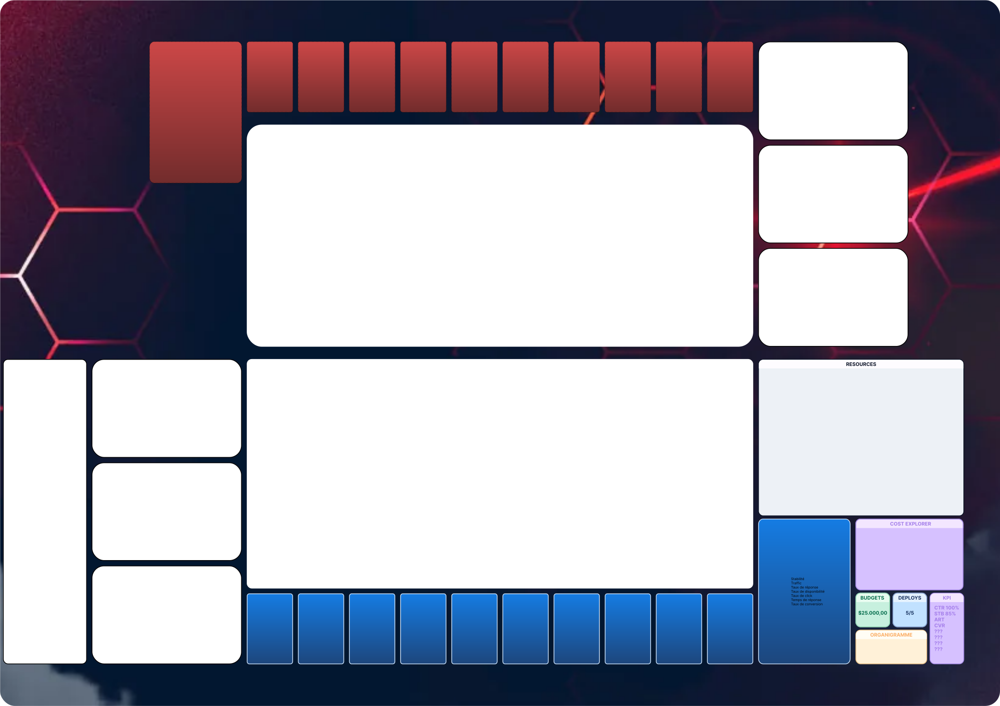

# Dev Card Battle

Phase d’une partie:Dans ce jeu pas de tours mais des jours !
Début de partie piocher 10 cartesPremière phase pioche une carte resource ou incidentDeuxieme phase utiliser ces déployment pour utiliser les resource ou incident acquis
Dernière phase fin de phase au tours de l’adversaire

