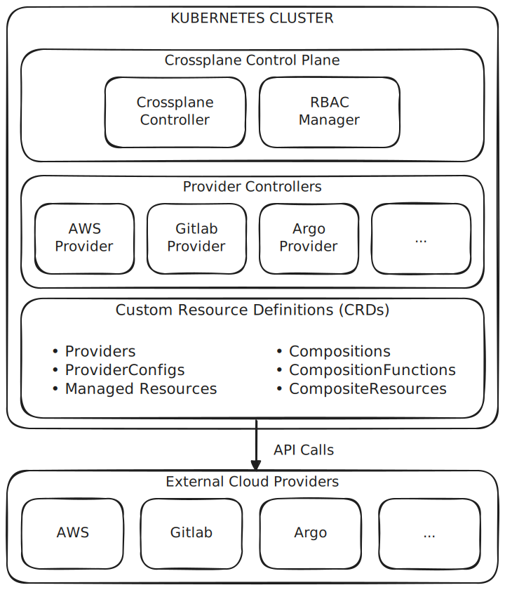

# Introduction

## Qu’est-ce que Crossplane ?
Crossplane est un projet open source hébergé par la Cloud Native Computing Foundation (CNCF) et principalement développé par Upbound. Il permet à Kubernetes de servir de control plane pour provisionner et gérer l'infrastructure sur différents cloud providers, mais également orchestrer des services (GitLab, ArgoCD, ...).

Pour cela, Crossplane étend Kubernetes avec les capacités suivantes:

- Des Custom Resource Definitions (CRDs) qui permettent de provisionner et gérer les ressources d'infrastructure (AWS, GCP, Azure, etc.) comme des objets Kubernetes natifs, via `kubectl` ou tout outil GitOps
- Des controllers chargés de réconcilier en continu l'état réel de l'infrastructure avec l'état déclaré (drift detection)
- Une gestion déclarative du cycle de vie complet des ressources au travers de manifestes YAML (création, mise à jour, suppression)
- Des Compositions et XRDs permettant d'abstraire et de composer plusieurs ressources en une API interne personnalisée, offrant du self-service aux équipes
- Une intégration native avec l'écosystème Kubernetes (ArgoCD, Kyverno, etc.), permettant de gérer l'infrastructure avec les mêmes workflows GitOps que les applications

---

## Pourquoi Crossplane ?

**Les limites de la gestion d'infrastructure traditionnelle:**

- **Multiplication des outils:** chaque cloud provider dispose de son propre CLI, SDK et outils de gestion (AWS CLI, gcloud, az cli)
- **Workflows fragmentés:** le déploiement applicatif passe par Kubernetes, tandis que l'infrastructure repose sur des outils séparés comme Terraform ou CloudFormation
- **Self-service limité:** les développeurs doivent souvent solliciter les équipes ops pour obtenir de l'infrastructure, créant des bottlenecks
- **Gestion des credentials complexe:** distribuer et sécuriser les credentials cloud entre les équipes est difficile à maintenir
- **Pas de réconciliation continue:** des outils comme Terraform sont push-only — si une ressource est modifiée ou supprimée manuellement, aucune correction automatique n'est appliquée

**Ce que Crossplane apporte:**

- **Un control plane unifié:** Kubernetes devient le point d'entrée unique pour gérer aussi bien les applications que l'infrastructure
- **Gestion déclarative:** l'infrastructure est déclarée en YAML et réconciliée en continu, exactement comme les workloads Kubernetes
- **GitOps natif:** les manifestes d'infrastructure peuvent être versionnés dans Git et déployés via ArgoCD ou Flux
- **Template d'infrastructure:** Template standardisés et réutilisables (VPC, base de données, etc.) via les Compositions et XRDs, favorisant une approche shift left
- **RBAC natif:** Définit précisément qui peut créer quelles ressources d'infrastructure, via les mécanismes RBAC de Kubernetes
- **Drift detection:** Crossplane surveille en permanence l'état réel de l'infrastructure et corrige automatiquement tout écart avec l'état déclaré, contrairement à Terraform qui nécessite un `plan/apply` manuel

---

## Architecture



**Composants:**

- **Crossplane Controller:** Gère le cycle de vie de Crossplane, orchestre les Compositions et installe les CRDs au démarrage
- **RBAC Manager:** Gère les permissions d'accès aux ressources Crossplane via RBAC Kubernetes 
- **Provider Controllers:** Controllers pluggables chargés de réconcilier les Managed Resources avec les APIs des plateformes cibles (AWS, GitLab, ArgoCD, etc.)
- **CRDs:** Définissent les schémas de toutes les ressources Crossplane, réparties en deux catégories :
  - *Providers, ProviderConfigs, Managed Resources* — les ressources d'infrastructure concrètes
  - *Compositions, CompositionFunctions, CompositeResources* — les abstractions et templates réutilisables
- **External Providers:** Les plateformes cibles exposant leurs APIs (AWS, GitLab, ArgoCD, etc.), contactées via des API Calls par les Provider Controllers

<!--
**Component Breakdown**

  - **Crossplane Core:** The main controller that manages the Crossplane lifecycle and core CRDs
  - **RBAC Manager:** Handles role-based access control for Crossplane resources
  - **Providers:** Pluggable controllers that manage resources for specific platforms (AWS, GCP, Azure, Kubernetes, etc.)
  - **CRDs:** Define the schemas for all Crossplane resources
-->
--- 

## Key Components

### 1. **Control Plane**

    The Crossplane Control Plane is the brain of the system. It consists of:

    **Core Controller:**

    - Watches Crossplane custom resources in the Kubernetes API
    - Manages the lifecycle of Providers, Compositions, and XRDs
    - Ensures the system is operating correctly

    **Reconciliation Loop:**

    - Continuously compares desired state (what you declared) vs actual state (what exists)
    - Takes actions to make actual state match desired state
    - Handles create, update, and delete operations

    **Key Responsibilities:**

    - Install and manage Providers
    - Create and manage CRDs
    - Coordinate between different Crossplane components
    - Handle errors and retries

### 2. **Custom Resource Definitions (CRDs)**

    What are CRDs?

    Custom Resource Definitions are Kubernetes' extension mechanism. They allow you to define new resource types beyond the built-in types (Pods, Services, Deployments, etc.).

    **How Crossplane Uses CRDs:**

    Crossplane installs CRDs for:

    - **Core Types:** `Provider`, `ProviderConfig`, `CompositeResourceDefinition`, `Composition`, `Function`
    - **Provider-Specific Types:** Each provider adds CRDs for its resources (e.g., `Bucket`, `Instance`, `Database`)

    Example CRD Usage:

    Comment # After installing AWS Provider, you get CRDs like:

    ```yaml linenums="1"
    apiVersion: s3.aws.crossplane.io/v1beta1
    kind: Bucket
    metadata:
      name: my-bucket
    spec:
      forProvider:
        region: us-east-1
        acl: private
    ```

    Why CRDs Matter:

    - Make infrastructure manageable with kubectl
    - Enable declarative infrastructure definitions
    - Integrate with Kubernetes RBAC, admission controllers, and operators
    - Allow infrastructure to be treated like any other Kubernetes resource

### 3. **Providers**

    **What is a Provider?**

    A Provider is a Crossplane package that extends Crossplane with support for managing resources on a specific platform.

    **Provider Structure:**

    Each provider contains:

    - CRDs: Define the resource types available (e.g., Bucket, Instance)
    - Controller: A pod that watches those resources and reconciles them
    - Metadata: Information about the provider (version, dependencies)

    **Common Providers:**

    - provider-aws: Manage AWS resources (S3, EC2, RDS, VPC, etc.)
    - provider-gcp: Manage Google Cloud resources (GCS, GCE, Cloud SQL, etc.)
    - provider-azure: Manage Azure resources (Blob Storage, VMs, SQL, etc.)
    - provider-kubernetes: Manage Kubernetes resources
    - provider-helm: Manage Helm releases
    - provider-sql: Manage SQL databases

    **How Providers Work:**

    1. You create a managed resource (e.g., S3 Bucket)
    2. Provider controller watches for that resource
    3. Controller makes API calls to AWS to create the bucket
    4. Controller updates the resource status in Kubernetes
    5. Controller continuously reconciles to ensure state matches

    **Provider Installation:**

    Providers are installed as Kubernetes resources:

    ```yaml linenums="1"
    apiVersion: pkg.crossplane.io/v1
    kind: Provider
    metadata:
      name: provider-aws
    spec:
      package: xpkg.upbound.io/crossplane-contrib/provider-aws:v0.40.0
    ```

    When applied, Crossplane:

    - Downloads the provider package (OCI image)
    - Extracts and installs the CRDs
    - Deploys the provider controller pod
    - Makes the provider ready to use

### 4. **Managed Resources (MRs)**

    **What is a Managed Resource?**

    A Managed Resource is a Kubernetes custom resource that represents a single piece of infrastructure in an external system.

    **Characteristics:**

    - Can be either cluster-scoped or namespaced (namespaced support added in v2)
    - Maps 1:1 with an external resource
    - Contains full configuration for the resource
    - Provides status information about the resource

    **Example - AWS S3 Bucket:**

    ```yaml linenums="1"
    apiVersion: s3.aws.crossplane.io/v1beta1
    kind: Bucket
    metadata:
      name: my-app-data-bucket
    spec:
      forProvider:
        region: us-west-2
        acl: private
        versioningConfiguration:
          status: Enabled
        serverSideEncryptionConfiguration:
          rules:
            - applyServerSideEncryptionByDefault:
                sseAlgorithm: AES256
      providerConfigRef:
        name: aws-provider-config
    ```

    **Managed Resource Lifecycle:**

    - Creation: When you apply the YAML, Crossplane creates the resource in the external system
    - Reconciliation: Crossplane continuously checks that the actual resource matches the desired state
    - Updates: Changes to the spec are applied to the external resource
    - Deletion: When you delete the resource, Crossplane deletes it from the external system

    **Status Fields:**

    Managed resources provide status information:

    ```bash
    status:
      conditions:
        - type: Ready
          status: "True"
          reason: Available
        - type: Synced
          status: "True"
          reason: ReconcileSuccess
      atProvider:
        bucketArn: arn:aws:s3:::my-app-data-bucket
        bucketDomainName: my-app-data-bucket.s3.amazonaws.com
    ```

### 5. **ProviderConfig**

    What is a ProviderConfig?

    A ProviderConfig defines authentication credentials and configuration for a provider.

    **Purpose:**

    - Tells the provider how to authenticate to the external platform
    - Can define different configurations for different environments
    - Referenced by managed resources to specify which credentials to use

    Example - AWS Provider:
    ```yaml
    apiVersion: aws.crossplane.io/v1beta1
    kind: ProviderConfig
    metadata:
      name: aws-production
    spec:
      credentials:
        source: Secret
        secretRef:
          namespace: crossplane-system
          name: aws-credentials
          key: credentials
    ```

    **Multiple ProviderConfigs:**

    You can have multiple ProviderConfigs for different purposes:

    - Different AWS accounts (dev, staging, prod)
    - Different GCP projects
    - Different regions
    - Different credential types

### 6. **Namespaces in Crossplane**

    **crossplane-system Namespace:**

Crossplane est installé par défaut dans le namespace `crossplane-system`.

    Crossplane is installed in the `crossplane-system` namespace by default.

    **What's in this namespace?**

    - Crossplane controller pods
    - RBAC manager pods
    - Provider controller pods
    - Secrets for provider credentials
    - ConfigMaps for configuration

    **Why a Dedicated Namespace?**

    - Isolation: Separates Crossplane components from other workloads
    - RBAC: Easier to manage permissions for Crossplane
    - Resource Management: Apply resource quotas and limits
    - Organization: Clear separation of concerns

    **Viewing Resources:**

    ```bash
    # See all pods in crossplane-system
    kubectl get pods -n crossplane-system
    ```

    ```bash
    # See all resources
    kubectl get all -n crossplane-system
    ```

---

## How Crossplane Works

**The Reconciliation Loop**

Crossplane uses Kubernetes' controller pattern with a reconciliation loop:


**Workflow Example: Creating an S3 Bucket**
Let's walk through what happens when you create an S3 bucket:

1. User Creates Resource

    ```bash hl_lines="1"
    kubectl apply -f s3-bucket.yaml
    ```

2. Kubernetes Stores Resource

    - Resource is stored in etcd
    - Kubernetes API server notifies watchers

3. Provider Controller Detects Change

    - AWS provider controller watches for Bucket resources
    - Sees the new bucket resource

4. Controller Reconciles

    - Reads the bucket spec
    - Checks if bucket exists in AWS
    - Bucket doesn't exist, so create it

5. Controller Calls AWS API

```bash
CreateBucket(
  Bucket: "my-app-data-bucket",
  Region: "us-west-2",
  ACL: "private"
)
```

6. Update Resource Status

- Update conditions: Ready=True, Synced=True
- Add AWS-specific details (ARN, domain name)

7. Continuous Monitoring

- Controller periodically checks bucket still exists
- Detects any drift (manual changes in AWS console)
- Reconciles back to desired state

**Resource Dependencies**

Crossplane handles resource dependencies automatically:

Example: VPC with Subnet

```bash
# VPC created first
apiVersion: ec2.aws.crossplane.io/v1beta1
kind: VPC
metadata:
  name: my-vpc
spec:
  forProvider:
    cidrBlock: 10.0.0.0/16

---
# Subnet references VPC
apiVersion: ec2.aws.crossplane.io/v1beta1
kind: Subnet
metadata:
  name: my-subnet
spec:
  forProvider:
    cidrBlock: 10.0.1.0/24
    vpcIdRef:
      name: my-vpc  # Reference to VPC resource
```

**Crossplane ensures:**

- VPC is created first
- Subnet waits for VPC to be ready
- Subnet uses actual VPC ID from AWS
- If VPC is deleted, subnet is deleted first

---

## Installation Methods

1. **Helm Installation (Recommended)**
Helm is the recommended way to install Crossplane.

Steps:

```bash
# Add Crossplane Helm repository
helm repo add crossplane-stable https://charts.crossplane.io/stable
helm repo update

# Install Crossplane
helm install crossplane crossplane-stable/crossplane \
  --namespace crossplane-system \
  --create-namespace
```

**Benefits:**

- Easy upgrades with helm upgrade
- Configurable via values.yaml
- Standard Kubernetes deployment method
- Easy to manage versions

**Common Configurations:**

```yaml title="values.yaml"
replicas: 2  # High availability

resources:
  limits:
    cpu: 500m
    memory: 512Mi

args:
  - --enable-composition-functions  # Enable composition functions (GA in v2)
```

2. **Kubectl Installation**

You can also install using kubectl:

```bash
kubectl create namespace crossplane-system
kubectl apply -f https://raw.githubusercontent.com/crossplane/crossplane/master/cluster/charts/crossplane/crds
```

3. **Verification**

After installation, verify:

```bash
# Check pods are running
kubectl get pods -n crossplane-system

# Should see:
# crossplane-xxx
# crossplane-rbac-manager-xxx

# Check CRDs are installed
kubectl get crds | grep crossplane

# Check Crossplane version
kubectl get deployment crossplane -n crossplane-system -o yaml | grep image:
```

## Best Practices

1. **Namespace Organization**

    - Use dedicated namespace: Always install Crossplane in crossplane-system for consistency
    - Separate credentials: Store provider credentials in Secrets within crossplane-system
    - Resource isolation: Keep Crossplane components isolated from application workloads

2. **Version Management**

    - Pin versions: Always specify explicit provider versions

    ```yaml
    spec:
      package: provider-aws:v0.40.0  # Good
      # package: provider-aws:latest  # Avoid
    ```

    - Test upgrades: Test Crossplane upgrades in non-production first
    - Monitor compatibility: Check provider compatibility with Crossplane version

3. **Security**

    - **Least privilege:** Use minimal IAM/RBAC permissions required
    - **Credential rotation:** Rotate provider credentials regularly
    - **Network policies:** Apply network policies to crossplane-system namespace
    - **Audit logging:** Enable audit logging for infrastructure changes

4. **Monitoring**

    - **Watch pod health:** Monitor Crossplane and provider pod health
    ```bash
    kubectl get pods -n crossplane-system -w
    ```

    - **Check resource status:** Regularly check managed resource conditions
    ```bash
    kubectl get managed
    ```

    - **Log aggregation:** Collect logs from Crossplane pods for troubleshooting

5. **Resource Management**

    - Set resource limits: Configure CPU and memory limits for controllers
    - Scale appropriately: Increase replicas for high availability
    - Clean up unused resources: Delete unused managed resources to avoid costs

6. **Development Workflow**

    - Use GitOps: Store all Crossplane manifests in Git
    - Environment separation: Use different ProviderConfigs for dev/staging/prod
    - Testing: Test infrastructure changes in development environments first
    - Documentation: Document your custom compositions and resource definitions

### Common Commands Reference

#### Installation and Setup

```bash
# Install Crossplane
helm install crossplane crossplane-stable/crossplane \
  --namespace crossplane-system \
  --create-namespace

# Install Crossplane CLI
curl -sL "https://raw.githubusercontent.com/crossplane/crossplane/master/install.sh" | sh
sudo mv crossplane /usr/local/bin
```

#### Checking Status
```bash
# Check all Crossplane pods
kubectl get pods -n crossplane-system

# Check installed CRDs
kubectl api-resources | grep crossplane

# Check providers
kubectl get providers

# Check all managed resources
kubectl get managed

# Get detailed resource info
kubectl describe <resource-type> <resource-name>
```

#### Troubleshooting
```bash
# View controller logs
kubectl logs -n crossplane-system deployment/crossplane

# View provider logs
kubectl logs -n crossplane-system deployment/<provider-name>

# Check resource events
kubectl describe <resource-type> <resource-name>

# Check resource conditions
kubectl get <resource-type> <resource-name> -o yaml | grep -A 10 conditions
```

## Summary
Crossplane transforms Kubernetes into a universal control plane for infrastructure management:

- Extends Kubernetes with CRDs for infrastructure resources
- Uses Providers to manage resources across different platforms
- Employs reconciliation loops to maintain desired state
- Enables declarative infrastructure using YAML manifests
- Supports GitOps workflows for infrastructure as code
- Provides platform abstraction through compositions