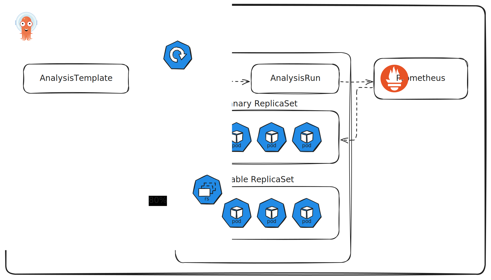
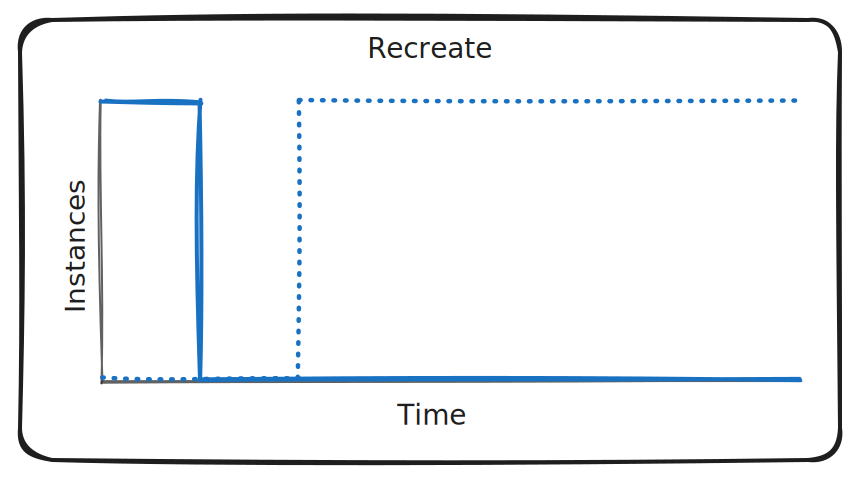
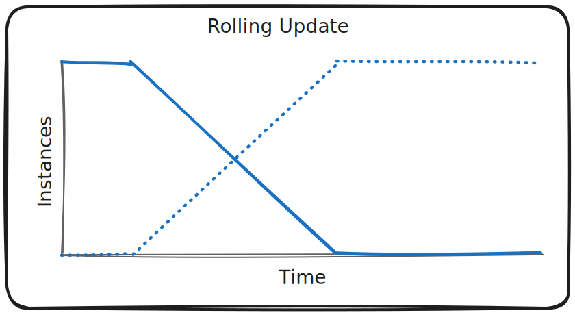

## Introduction

### Chapter Overview and Objectives
In this chapter, we delve into Argo Rollouts, a pivotal tool within the Argo suite, designed specifically for Continuous Delivery (CD) and GitOps practices. Argo Rollouts can be used as a stand-alone tool and therefore does not require any prior knowledge of ArgoCD (or other Argo-related tools). Through thematic discussions and hands-on labs, we aim to equip you with a comprehensive understanding of Argo Rollouts’ architecture, installation, and usage.

By the end of this chapter, you should be able to:

Understand and differentiate various Progressive Delivery patterns and decide when to use which.
Have a thorough understanding of what Argo Rollouts is and in what scenarios it might help.
Have an overview of Argo Rollouts architecture and functionality.

## Argo Rollouts Features

Progressive Delivery: Déployer progressivement de nouvelles versions de logiciels à un sous ensemble d'utilisateurs pour minimiser le risque
Rollout CRD: Rollout Controller est un CRD Kubernetes qui remplace l'objet de déploiement standard pour permettre ces stratégies avances
Canary Release: Expose une nouvelle version à un petit groupe d'utilistaur pour des test en direct avant un déploiement complet
Blue-Green Deployment: Fonctionner deux environement blue est stable et green est la nouvelle version. Switch traffic une fois que green est déployer green deviens blue
Analysis (metric providers): Intéroge des fourniseur de metriques comme Prometheus pour verfiiser si la nouvelle version est saine avant de continuer
Traffic Shaping: % pourcentage d'utilisateur qui bascule sur la nouvelle version (ingress controllers ou service mesh)
Automated rollbacks: Scrap des donnée de performance si l'analyse échoue le déploiement est automatiquement rétablie a la version stable précédente
gitops integration:

## Architecture



## Installation Options

### Standard Cluster-Wide Installation

#### Deploy Argo Rollouts

Create a namespace for Argo Rollouts using the following command:

```bash hl_lines="1"
kubectl create namespace argo-rollouts
```

Deploy Argo Rollouts using the quick start manifest:

```bash hl_lines="1"
kubectl apply -n argo-rollouts -f https://github.com/argoproj/argo-rollouts/releases/download/v1.8.3/install.yaml
```

This will install custom resource definitions as well as the Argo Rollouts controller.  
During this course we use Argo Rollouts in version 1.8.3. We recommend using the same version to ensure consistent results.  

Verify that Argo Rollouts is installed by running the following command:

```bash hl_lines="1"
kubectl get pods -n argo-rollouts
```

### Restrictedn Namespace-Scoped Installation

Limité à un namespace

#### Deploy Argo Rollouts Namespace Scoped

Create a namespace for Argo Rollouts using the following command:

```bash hl_lines="1"
kubectl create namespace argo-rollouts
```

Deploy Argo Rollouts using the quick start manifest:

```bash hl_lines="1"
kubectl apply -n argo-rollouts -f https://github.com/argoproj/argo-rollouts/../v1.8.3/download/namespace-install.yaml
```

Admin de cluster requi pour installer les CRDs de rollout séparement

---

#### CLI Installation

Install Rollouts kubectl Plugin
Unlike Argo CD and Argo Workflows, Argo Rollouts uses a kubectl plugin as its CLI client.
Download the latest Argo Rollouts kubectl plugin version from
https://github.com/argoproj/argo-rollouts/releases/latest/.
On Ubuntu 24.04, you can install the CLI using the following commands:
Copyright, The Linux Foundation 2025. All rights reserved.
2
LFS256-v11.07.2025
$ wget
https://github.com/argoproj/argo-rollouts/releases/download/v1.8.3/kub
ectl-argo-rollouts-linux-amd64 -O kubectl-argo-rollouts
$ chmod +x kubectl-argo-rollouts
$ sudo mv kubectl-argo-rollouts /usr/local/bin/
More detailed installation instructions can be found via the CLI installation documentation.
This is also available in Mac, Linux and WSL Homebrew. Use the following command:
brew install argoproj/tap/kubectl-argo-rollouts
Verify that the argo CLI is installed correctly by running the following command:
kubectl argo rollouts version

```bash hl_lines="1"
brew install argoproj/tap/kubectl-argo-rollouts
```

---

```bash hl_lines="1"
kubectl -n argo-rollouts get all
NAME                                 READY   STATUS    RESTARTS   AGE
pod/argo-rollouts-7858b65d86-bcbhq   1/1     Running   0          8m55s

NAME                            TYPE        CLUSTER-IP   EXTERNAL-IP   PORT(S)    AGE
service/argo-rollouts-metrics   ClusterIP   10.96.68.1   <none>        8090/TCP   8m55s

NAME                            READY   UP-TO-DATE   AVAILABLE   AGE
deployment.apps/argo-rollouts   1/1     1            1           8m55s

NAME                                       DESIRED   CURRENT   READY   AGE
replicaset.apps/argo-rollouts-7858b65d86   1         1         1       8m55s
```

## A Primer on Progressive Delivery

### Essentials of CI/CD and Progressive Delivery in Software Development
Continuous Integration (CI), Continuous Delivery (CD), and Progressive Delivery are key concepts in modern software development, particularly in the context of DevOps and agile practices. They represent different stages or approaches in the software release process. We will discuss them more in this chapter.


### Continuous Integration
Continuous Integration is a development practice where developers frequently integrate their code into a shared repository, preferably several times daily. Each integration is then verified by an automated build and automated tests.

CI Features

- **Frequent code commits:**  
Encourage developers to often integrate their code into the main branch, reducing integration challenges.

- **Automated tests:**  
Cover frequent code commits. Automatically running tests on the new code to ensure it integrates well with the existing codebase. This does not only include unit tests, but also any other higher-order testing method, such as integration- or end-to-end tests.

- **Immediate problem detection:**  
Allows for quick detection and fixing of integration issues.

- **Reduced integration problems:**  
Help to minimize the problems associated with integrating new code.

The main goal of CI is to provide rapid feedback so that if a defect is introduced into the code base, it is identified and corrected as soon as possible.

Once code is in our main branch, it is not deployed in production or even released. This is where the concept of Continuous Delivery comes into play.

---

### Continuous Delivery
Continuous Delivery is an extension of CI, ensuring the software can be reliably released anytime. It involves the automation of the entire software release process.

- **CD Features:**

    - **Automated release process:**  
    Every change that passes the automated tests can be released to production through an automated process.

    - **Reliable deployments:**  
    Ensure that the software is always in a deployable state.

    - **Rapid release cycles:**  
    Facilitate frequent and faster release cycles.

    - **Close collaboration between teams:**  
    A close alignment between development, QA, and operations teams is required.

The objective of Continuous Delivery is to establish a process where software deployments become predictable, routine, and can be executed on demand.

---

### Progressive Delivery
Progressive delivery is often described as an evolution of continuous delivery. It focuses on releasing updates of a product in a controlled and gradual manner, thereby reducing the risk of the release, typically coupling automation and metric analysis to drive the automated promotion or rollback of the update.


- **Progressive Delivery Features:**

    - **Canary releases:**
    Gradually roll out the change to a small subset of users before rolling it out to the entire user base.

    - **Feature flags:**
    Control who gets to see what feature in the application, allowing for selective and targeted deployment.

    - **Experiments & A/B testing:**
    Test different versions of a feature with different segments of the user base.

    - **Phased rollouts:**
    Slowly roll out features to incrementally larger segments of the user base, monitoring and adjusting based on feedback.

The primary goal of Progressive Delivery is to reduce the risk associated with releasing new features and to enable faster iteration by getting early feedback from users.

---

### Deployment Strategies / Deyployment and Release pattern
Every software system is different, and deploying complex systems oftentimes requires additional steps and checks. This is why different deployment strategies emerged over time to manage the process of deploying new software versions in a production environment.

These strategies are an integral part of DevOps practices, especially in the context of CI/CD workflows. The choice of a deployment strategy can significantly impact the availability, reliability, and user experience of a software application or software service.

On the following pages, we will present the four most important deployment strategies and discuss their impact on user experience during deployment:

- Recreate
- Rolling update
- Blue-green deployment
- Canary deployment

---

#### Recreate

Un déploiement `Recreate` supprime l’ancienne version de l’application avant de démarrer la nouvelle. Par conséquent, cela garantit que deux versions de l’application ne s’exécutent jamais en même temps, mais il y a un temps d’arrêt pendant le déploiement.
<p align="center">
   
</p>

Cette stratégie est une option de l’objet Deployment de Kubernetes et convient aux environnements où un bref temps d’arrêt est acceptable ou lorsque la persistance de l’état n’est pas une préoccupation.

---

#### Rolling Update

!!! Quote "Contexte"
    Vous devez déployer une nouvelle version de votre application sans pouvoir tolérer la moindre interruption de service. Cependant, lancer simultanément l’ensemble des nouveaux pods n’est pas envisageable, car cela risquerait de surcharger le cluster.

    Il est donc nécessaire d’adopter une stratégie de déploiement progressive permettant de remplacer les anciennes versions par les nouvelles tout en maintenant la disponibilité et la stabilité du système.

Une Rolling Update remplace progressivement les pods exécutant l’ancienne version du container par de nouveaux pods exécutant la nouvelle version du container..  
À mesure que la nouvelle version est mise en service, les anciens pods sont réduits afin de maintenir le nombre total d’instances de l’application, tout en surveillant la santé et la disponibilité du service après chaque étape.  
Cela permet de réduire le temps d’arrêt et les risques, car la nouvelle version est déployée de manière contrôlée.  

<p align="center">
   
</p>

Cette approche garantit une perturbation minimale et une disponibilité continue de l’application.
En cas de problème avec un nouveau pod, le rollout peut être mis en pause ou annulé.

!!! Note 
    Rolling Update et la stratégie par défaut de l’objet `Deployment` de Kubernetes.  
    Kubernetes utilise les valeurs par défaut (25%)

    Il n'est pas nécéssaire de rajouter une strategy dans l'objet `Deployment` par défault il utiliseras la configuration ci-dessous:
    Tu n’es pas obligé de rajouter ça dans ton Deployment si tu veux juste le comportement par défaut.

    ```yaml
      strategy:
        type: RollingUpdate
        rollingUpdate:
          maxSurge: 1 
          maxUnavailable: 1 
    ```
    
    Voici pourquoi :

    1️⃣ Comportement par défaut

    Pour un Deployment Kubernetes, si tu ne précises pas de strategy :

    strategy:
      type: RollingUpdate


    C’est exactement le rolling update qui va se passer.

    Les valeurs par défaut pour maxSurge et maxUnavailable sont :

    maxSurge: 25%       # jusqu’à 25% de pods en plus
    maxUnavailable: 25% # jusqu’à 25% de pods indisponibles


    Donc pour ton Deployment avec replicas: 3 :

    maxSurge: 25% → arrondi à 1 pod supplémentaire au maximum

    maxUnavailable: 25% → arrondi à 0 ou 1 pod indisponible (Kubernetes arrondit à l’entier supérieur pour maxUnavailable)

    2️⃣ Quand tu voudrais le mettre explicitement

    Tu utiliserais :

    strategy:
      type: RollingUpdate
      rollingUpdate:
        maxSurge: 1
        maxUnavailable: 1


    Ici tu contrôles exactement qu’au maximum 1 pod supplémentaire sera créé et qu’au maximum 1 pod peut être indisponible à la fois.

    C’est utile si tu veux contrôler très finement le trafic ou si tu as des pods qui consomment beaucoup de ressources.

    ✅ Conclusion

    Si tu es d’accord avec le comportement par défaut (Kubernetes fait un rolling update avec au maximum 1 pod sur 3 indisponible à la fois), tu n’as pas besoin de l’ajouter.

    Ajouter cette section est juste pour plus de précision et contrôle, pas pour que ça fonctionne.

    Si tu veux, je peux te montrer un petit tableau qui compare le comportement par défaut vs maxSurge/maxUnavailable explicites, ça rend tout super clair pour 3 pods. Veux que je fasse ça ?

    maxSurge et maxUnavailable sont des pourcentage obligatoire ?

    Non, ils ne sont pas obligatoirement des pourcentages, tu peux les spécifier en nombre absolu de pods. Kubernetes accepte les deux formats :

    1️⃣ En pourcentage
    maxSurge: 25%       # 25% des replicas, arrondi à l'entier supérieur
    maxUnavailable: 25% # idem


    Pour ton Deployment de 3 pods :

    25% → 0,75 → arrondi à 1 pod.

    Avantage : ça s’adapte automatiquement si tu changes le nombre de replicas.

    2️⃣ En nombre absolu
    maxSurge: 1
    maxUnavailable: 1


    Ici, Kubernetes prend exactement 1 pod, peu importe le nombre total de replicas.

    Avantage : tu as un contrôle strict, utile pour des déploiements sensibles ou des petits clusters.

    3️⃣ Important

    Tu dois toujours mettre une valeur pour maxSurge et maxUnavailable si tu définis strategy: RollingUpdate.

    Mais si tu ne définis pas strategy du tout, Kubernetes utilise les valeurs par défaut (25%), donc tu n’as rien à mettre.
---


GitOps:
Le dev modifie dans le manifest de deployment la version de 1.0 à 2.0 et le push 
argo prendra en considération la modification et déploieras la nouvelle app selon les indication fournis dans la strategy

```yaml linenums="1"
apiVersion: apps/v1
kind: Deployment
metadata:
  name: example-app
  namespace: default
  labels:
    app: example-app
spec:
  replicas: 3
  strategy:
    type: RollingUpdate
    rollingUpdate:
      maxSurge: 1 # (1)! 
      maxUnavailable: 1 # (2)! 
  selector:
    matchLabels:
      app: example-app
  template:
    metadata:
      labels:
        app: example-app
    spec:
      containers:
      - name: app
        image: nginx:1.24
        ports:
        - containerPort: 80
          name: http
        resources:
          requests:
            memory: "64Mi"
            cpu: "50m"
          limits:
            memory: "128Mi"
            cpu: "100m"
        readinessProbe:
          httpGet:
            path: /
            port: 80
          initialDelaySeconds: 5
          periodSeconds: 10
        livenessProbe:
          httpGet:
            path: /
            port: 80
          initialDelaySeconds: 15
          periodSeconds: 20
```

1.  **maxSurge**  
    Nombre max ***(Pourcentage ou Absolue)*** de pods en plus pendant l'update
2.  **maxUnavailable**  
    Nombre max ***(Pourcentage ou Absolue)*** de pods indisponibles pendant l'update

Pour déclencher un Rolling Update, tu modifies simplement l'image dans le Deployment :

```bash
# Via kubectl
kubectl set image deployment/example-app app=nginx:1.25

# Ou en éditant le manifest et en appliquant
kubectl apply -f deployment.yaml

# Suivre le status du rollout
kubectl rollout status deployment/example-app

# Voir l'historique
kubectl rollout history deployment/example-app

# Rollback si nécessaire
kubectl rollout undo deployment/example-app
```

Les points clés pour un Rolling Update efficace:

  - Strategy configuration : Les paramètres maxSurge et maxUnavailable contrôlent la vitesse et la disponibilité pendant l'update  
  - Readiness/Liveness probes : Essentielles pour que Kubernetes sache quand un pod est prêt à recevoir du trafic  
  - Resources limits : Permet au scheduler de placer correctement les pods pendant l'update

---


---

### Blue/Green

---

### Canary Release

---

## Direct Conversion Method

deployment.yaml
Que fait Kubernetes exactement ?

1. Kubernetes compare la nouvelle spec avec l’ancienne.
2. Il voit que l’image a changé, donc il doit créer de nouveaux pods.
3. Le rolling update va fonctionner comme suit:b

    - Kubernetes va créer un nouveau pod avec l’image green.
    - Quand ce pod est Ready (liveness et readiness passent), il supprime un pod blue existant.
    - Il répète ce processus jusqu’à ce que tous les pods soient remplacés par des pods green.

Donc le cycle est :

- 3 pods blue
- 3 pods blue → 1 pod green
- 2 pods blue → 2 pods green
- 1 pod blue → 3 pods green
- 3 pod green

Détails sur les pods:

- Les pods blue sont supprimés progressivement.
- Les pods green sont créés progressivement.
- Tu n’as jamais de downtime complet si tes pods sont correctement configurés avec readiness probes, car le Service continuera à router le trafic vers les pods Ready.

!!! Quote ""

    <div class="grid" markdown>

    !!! Quote ""

        ```yaml linenums="1" title="deployment.yaml" hl_lines="1 2 4"
        apiVersion: apps/v1
        kind: Deployment
        metadata:
          name: blue-green-deployment
        spec:
          replicas: 3
          selector:
            matchLabels:
              app: blue-green
          template:
            metadata:
              labels:
                app: blue-green
            spec:
              containers:
                - name: blue-green-container
                  image: siddharth67/app:blue
        ```

    !!! Quote ""

        ```yaml linenums="1" title="rollout.yaml" hl_lines="1 2 4 18-22"
        apiVersion: argoproj.io/v1alpha1
        kind: Rollout
        metadata:
          name: blue-green-rollout
        spec:
          replicas: 3
          selector:
            matchLabels:
              app: blue-green
          template:
            metadata:
              labels:
                app: blue-green
            spec:
              containers:
                - name: blue-green-container
                  image: siddharth67/app:blue
          strategy:
            blueGreen:
              activeService: blue-green-active-svc
              previewService: blue-green-preview-svc
              autoPromotionEnabled: false
        ```

        **Pros**:

          - Rollout adds advanced strategies like blue-green and canary
          - Keeps the same pod template and replicas
          - Traffic can be controlled via active/preview services
          - Auto-promotion can be manual ou automatic

    </div>

---

## workloadRef Method 
https://learn.kodekloud.com/user/courses/certified-argo-project-associate-capa/module/959dfde0-9415-4fc2-bcad-fe9e4bf84cc7/lesson/d363f5a0-40da-4442-9a84-91862257155e

```yaml linenums="1" title="deployment.yaml" hl_lines="1 2 4"
apiVersion: apps/v1
kind: Deployment
metadata:
  name: blue-green-deployment
spec:
  replicas: 3
  selector:
    matchLabels:
      app: blue-green
  template:
    metadata:
      labels:
        app: blue-green
    spec:
      containers:
        - name: blue-green-container
          image: siddharth67/app:blue
```

```yaml linenums="1" title="rollout.yaml" hl_lines="1 2 4 18-22"
apiVersion: argoproj.io/v1alpha1
kind: Rollout
metadata:
  name: blue-green-rollout
spec:
  workloadRef:
    apiVersion: apps/v1
    kind: Deployment
    name: blue-green-deployment
    scaleDown: never | onsuccess | progressively
  strategy:
    blueGreen:
      activeService: blue-green-active-svc
      previewService: blue-green-preview-svc
      autoPromotionEnabled: false
```

https://argo-rollouts.readthedocs.io/en/stable/features/specification/


### Strategies for Smooth and Reliable Releases
In summary, deployment strategies are fundamental in modern software development and operations for ensuring smooth, safe, and efficient software releases. They cater to the need for balancing rapid deployment with the stability and reliability of production environments.


#### Benefits of Introducing Deployment Strategies

| **Benefit**            | **Description**                                                                                                                                                       |
|------------------------|-----------------------------------------------------------------------------------------------------------------------------------------------------------------------|
| **Risk mitigation**     | - They allow for safer deployments by reducing the risk of introducing bugs or performance issues into the production environment. <br> - Strategies like canary deployments enable gradual exposure to new changes. |
| **User experience**     | - Maintaining a consistent and high-quality user experience is essential. <br> - Strategies like blue-green deployments minimize downtime and potential disruptions to the user experience. |
| **Feedback and testing**| - They provide a framework for gathering real-world user feedback. <br> - Canary deployments, in particular, are valuable for understanding how changes perform in a live environment. |
| **Rollback capabilities**| - In case new versions have critical issues, strategies like blue-green deployments allow for quick rollbacks to the previous stable version. |


#### Common Use Cases for Each Strategy

| **Strategy**            | **Supported By**   | **Common Use Cases**                                                                                                                                                       |
|-------------------------|--------------------|--------------------------------------------------------------------------------------------------------------------------------------------------------------------------|
| **Fixed deployment**     | Kubernetes Native  | - The most basic way to deploy a workload is whenever downtime is acceptable. <br> - Often stateful workloads (e.g., Databases) require a “recreation” to avoid data corruption. |
| **Rolling update**       | Kubernetes Native  | - Commonly used for stateless, low-maintenance workloads like proxies, RESTful APIs, etc.                                                                                 |
| **Blue-green deployment**| Argo Rollouts      | - Use when a) you can afford the extra cost of running twice the resources and b) need a quick and easy rollback option. <br> - B/G can also be helpful for experimentation scenarios. <br> - Can be advantageous to update services that depend on stateful connections, e.g., via WebSockets. |
| **Canary deployment**    | Argo Rollouts      | - Use it whenever a partial rollout is desirable (experimentation with a subset of users, desire a gradual rollout over hours or days, want to make rollout dependent on certain conditions). <br> - It can be a good alternative if the deployments are too large and the infra cost of running a full blue-green is too high. |
