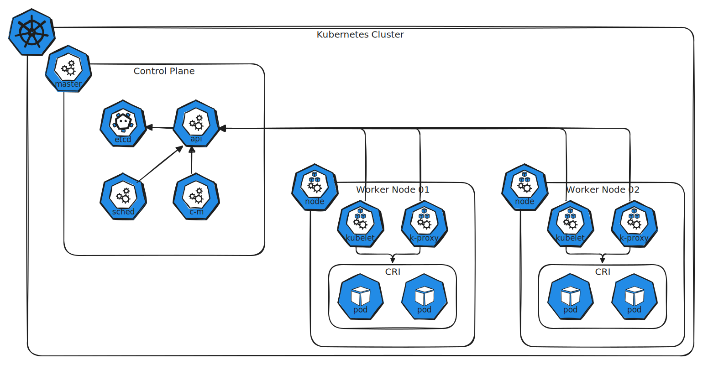

> This article provides an overview of Kubernetes cluster architecture, detailing the roles and components of master and worker nodes in managing containerized applications.

Hello and welcome to our comprehensive guide on Kubernetes cluster architecture. In this article, we provide a high-level overview of how Kubernetes organizes and manages containerized applications. You will learn about each component’s roles, responsibilities, and configurations, as well as practical insights into examining an existing cluster.

Kubernetes simplifies the deployment, scaling, and management of containerized applications through automation. To help explain this concept, imagine two kinds of ships: cargo ships (worker nodes) that carry containers, and control ships (master nodes) that monitor and manage the cargo ships. In Kubernetes, the cluster consists of nodes—whether physical or virtual, on-premises or cloud-hosted—that host your containerized applications.

## Master Node Components

The master node contains several control plane components that manage the entire Kubernetes cluster. It keeps track of all nodes, decides where applications should run, and continuously monitors the cluster. Think of the master node as the central command center coordinating the fleet.

<!--
<Frame>
  
</Frame>
-->

In a busy harbor, many containers are loaded and unloaded daily. Kubernetes maintains detailed information about each container and its corresponding node in a highly available key-value store called etcd. Etcd uses a simple key-value format along with a quorum mechanism, ensuring reliable and consistent data storage across the cluster.

When a new container (or "ship cargo") is ready, the Kubernetes scheduler—similar to port cranes—determines which worker node (or "ship") should host it. The scheduler takes into account current load, resource requirements, and specific constraints like taints, tolerations, or node affinity rules. This scheduling process is vital for efficient cluster operation.

!!! note
    The Kubernetes replication controller and other controllers work like dock office staff, ensuring that the desired number of containers are running and managing node operations.

Other key master node components include:

- **ETCD:** Stores cluster-wide configuration and state data.
- **Kube Scheduler:** Determines the best node for new container deployments.
- **Controllers:** Manage node lifecycle, container replication, and system stability.
- **Kube API Server:** Acts as the central hub for cluster communication and management.

<!--
<Frame>
  
</Frame>
-->

## Worker Node Components

Worker nodes, which can be compared to cargo ships, are responsible for running the containerized applications. Each node is managed by the Kubelet, the node’s “captain,” which ensures that containers are running as instructed.

- **Kubelet:** Manages container lifecycle on an individual node. It receives instructions from the Kube API server to create, update, or delete containers, and regularly reports the node's status.
- **Kube Proxy:** Configures networking rules on worker nodes, thus enabling smooth inter-container communication across nodes. For instance, it allows a web server on one node to interact with a database on another.

!!! info
    The entire control system is containerized. Whether you are using Docker, Containerd, or CRI-O, every node (including master nodes with containerized components) requires a compatible container runtime engine.

The high-level worker node architecture ensures that applications remain available and responsive, even as they communicate across a distributed network.

<!--
<Frame>
  
</Frame>
-->

## Summary of Kubernetes Architecture

The Kubernetes cluster architecture is divided into two main segments:

| Component Category | Key Components                                     | Description                                                                                                 |
| ------------------ | -------------------------------------------------- | ----------------------------------------------------------------------------------------------------------- |
| **Master Node**    | etcd, Kube Scheduler, Controllers, Kube API Server | Centralized control and management of the entire cluster.                                                   |
| **Worker Node**    | Kubelet, Kube Proxy                                | Responsible for the lifecycle management of containers and ensuring network communication between services. |

This clear separation and coordination between master and worker nodes is fundamental to Kubernetes' ability to automate and streamline container orchestration.