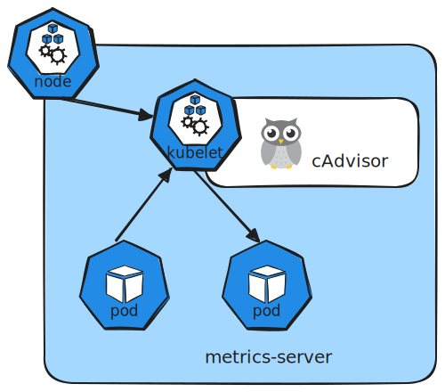

> Dans cet article, nous verrons comment surveiller la consommation des ressources dans un cluster Kubernetes afin d’obtenir une meilleure visibilité sur les performances de vos nœuds et de vos pods. Comprendre comment les ressources sont utilisées au sein de votre cluster est essentiel pour maintenir sa stabilité et optimiser vos charges de travail.

## What to Monitor

Effectively monitoring a Kubernetes cluster involves tracking metrics at both the node and pod levels.

For nodes, consider monitoring the following:

- Total number of nodes in the cluster
- Health status of each node
- Performance metrics such as CPU, memory, network, and disk utilization

For pods, focus on:

- The number of running pods
- CPU and memory consumption for every pod

Because Kubernetes does not include a comprehensive built-in monitoring solution, you must implement an external tool. Popular open-source monitoring solutions include Metrics Server, Prometheus, and Elastic Stack. In addition, proprietary options like Datadog and Dynatrace are available for more advanced use cases.


## <!--From Heapster to--> Metrics Server

<!--
Historically, Heapster provided monitoring and analysis support for Kubernetes. Although many reference architectures still mention Heapster, it has been deprecated. Its streamlined successor, Metrics Server, is now the standard for monitoring Kubernetes clusters.

<Frame>
  
</Frame>
-->

Metrics Server is designed to be deployed once per Kubernetes cluster. It collects metrics from nodes and pods, aggregates the data, and retains it in memory. 

Keep in mind that because Metrics Server stores data only in memory, it does not support historical performance data. For long-term metrics, consider integrating more advanced monitoring solutions.

<!--
<Frame>
  
</Frame>
-->

!!! note 
    Metrics Server is ideal for short-term monitoring and quick insights but is not meant for prolonged historical data analysis. For in-depth analytics, look into integrating Prometheus or Elastic Stack.

## How Metrics are Collected

Every Kubernetes node runs a service called the Kubelet, which communicates with the Kubernetes API server and manages pod operations. Within the Kubelet, an integrated component called cAdvisor (Container Advisor) is responsible for collecting performance metrics from running pods. These metrics are then exposed via the Kubelet API and retrieved by Metrics Server.



<!--
<Frame>
  
</Frame>
-->

## Deploying Metrics Server

Pour installer metrics-server dans un cluster Kubernetes créé avec kind, il faut une petite adaptation car les certificats TLS dans kind ne sont pas toujours reconnus par défaut.

```bash
kind create cluster
```

```bash
kubectl apply -f https://github.com/kubernetes-sigs/metrics-server/releases/latest/download/components.yaml
serviceaccount/metrics-server created
clusterrole.rbac.authorization.k8s.io/system:aggregated-metrics-reader created
clusterrole.rbac.authorization.k8s.io/system:metrics-server created
rolebinding.rbac.authorization.k8s.io/metrics-server-auth-reader created
clusterrolebinding.rbac.authorization.k8s.io/metrics-server:system:auth-delegator created
clusterrolebinding.rbac.authorization.k8s.io/system:metrics-server created
service/metrics-server created
deployment.apps/metrics-server created
apiservice.apiregistration.k8s.io/v1beta1.metrics.k8s.io created
```

```bash
kubectl patch deployment metrics-server \
  -n kube-system \
  --type=json \
  -p='[{"op":"add","path":"/spec/template/spec/containers/0/args/-","value":"--kubelet-insecure-tls"}]'
```

```bash
kubectl get pods -n kube-system | grep metrics-server
metrics-server-5f54fb74d9-pdqx4              1/1     Running   0          2m47s
```

## Viewing Metrics

Once Metrics Server is active, you can check resource consumption on nodes with this command:

```bash hl_lines="1"
kubectl top nodes
NAME                 CPU(cores)   CPU(%)   MEMORY(bytes)   MEMORY(%)
test-control-plane   89m          0%       682Mi           4%
```

This will display the CPU and memory usage for each node, for example showing that 8% of the CPU on your master node (approximately 166 milli cores) is in use.

To check performance metrics for pods, run:

```bash hl_lines="1"
kubectl top pods
NAME                                         CPU(cores)   MEMORY(bytes)
coredns-7d764666f9-6pbsk                     2m           12Mi
coredns-7d764666f9-shp6n                     2m           13Mi
etcd-test-control-plane                      16m          33Mi
kindnet-nfdvl                                1m           10Mi
kube-apiserver-test-control-plane            27m          207Mi
kube-controller-manager-test-control-plane   11m          53Mi
kube-proxy-8j95x                             1m           13Mi
kube-scheduler-test-control-plane            5m           22Mi
metrics-server-5f54fb74d9-pdqx4              3m           19Mi
```

!!! note
    Run these commands periodically to monitor resource usage trends and quickly identify potential performance issues.

## Conclusion

This guide has walked you through the fundamentals of monitoring a Kubernetes cluster using Metrics Server. By understanding the key metrics and using the provided commands, you'll be well-equipped to maintain successful and efficient cluster operations. Experiment with these techniques and continue exploring additional monitoring tools for deeper insights.