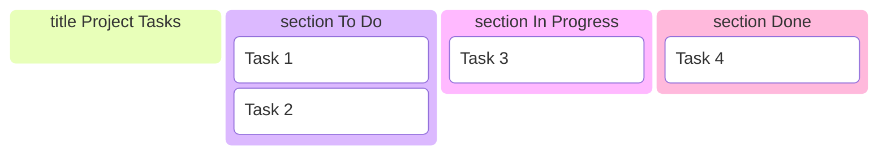
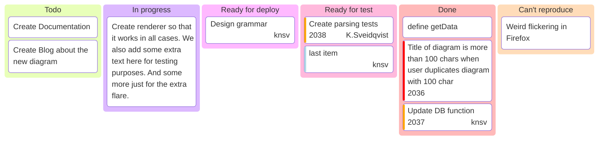
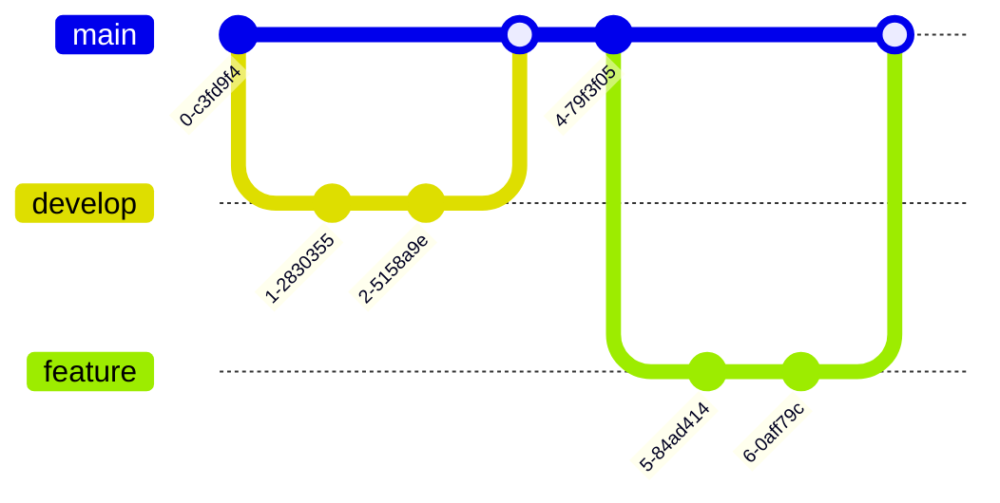
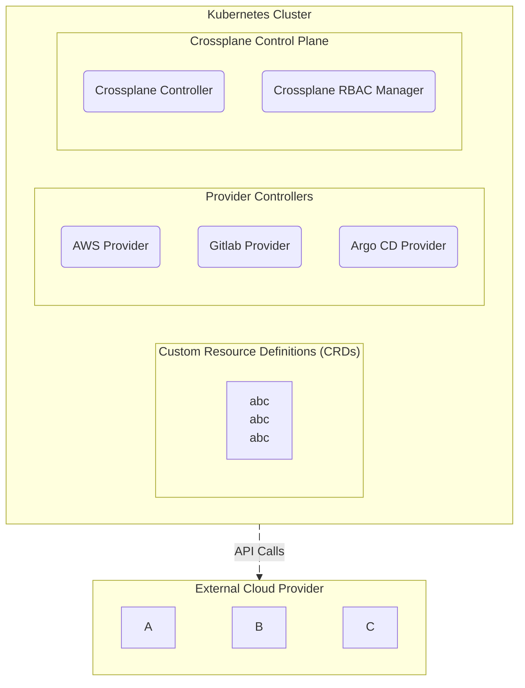

## Open link in a new browser window 

* [Terraform Registry](https://registry.terraform.io/){target=_blank}
{target=_blank}

[Attribute Lists](#pattern-matching){ data-preview }

- [Abbreviations]
- [Attribute Lists]
- [Snippets]

  [Abbreviations]: ../../../applications/crossplane/01-fundamentals/01-introduction.md#managed-resources
  [Attribute Lists]: ../../../applications/crossplane/01-fundamentals/01-introduction.md#managed-resources
  [Snippets]: ../../../applications/crossplane/01-fundamentals/01-introduction.md#managed-resources
 

 note → pour du contexte, historique, non essentiel ✅ (ton cas)
info → pour une info utile dans le flow principal
abstract → pour un résumé / introduction